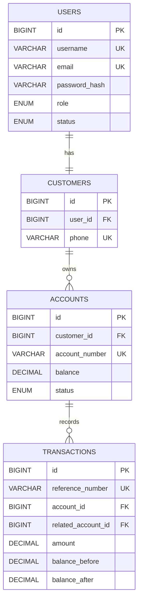
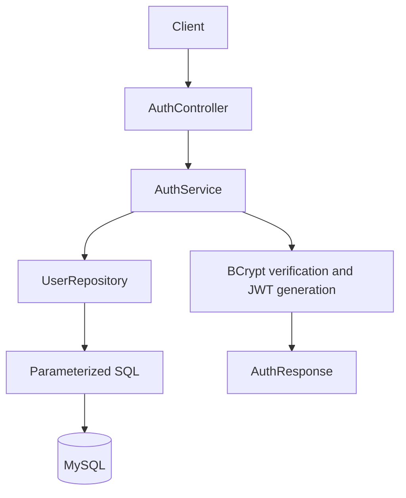
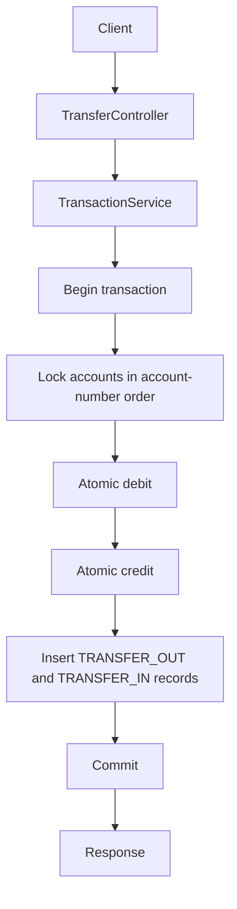

# AMANAH — Halal Banking System (Backend)

A Spring Boot 3 REST API for a Shariah-compliant banking system. Built with
Spring Boot 3.2, Spring Security (JWT), Spring JDBC (`JdbcTemplate`), Flyway
migrations, and MySQL 8.

## Features

- **Authentication**: register / login with BCrypt-hashed passwords and JWT tokens.
- **Customers**: view and update own profile.
- **Accounts**: create `SAVINGS` or `WADIAH` accounts, list, view, and check balance.
- **Transactions**: deposit, withdraw, and transfer between accounts with
  atomic, race-safe SQL balance updates.
- **Admin**: suspend/activate users; freeze/unfreeze/close accounts; look up customers.
- **Auditing**: every money movement is recorded with a unique reference number
  (`TXN` + `yyMMddHHmmss` + 5 random digits = exactly 20 chars, matching the
  `transactions.reference_number VARCHAR(20)` column), balance before/after, and
  a description.

## Tech Stack

| Layer        | Technology                          |
|--------------|-------------------------------------|
| Language     | Java 21                             |
| Framework    | Spring Boot 3.2.5                   |
| Security     | Spring Security + JJWT 0.12.5       |
| Persistence  | Spring JDBC (`JdbcTemplate`)        |
| Migrations   | Flyway                              |
| Database     | MySQL 8                             |
| Build        | Maven                               |
| Container    | Docker / Docker Compose             |

## Getting Started

### Option 1 — Docker Compose (recommended)

```bash
cp .env.example .env      # then edit values
docker compose up --build
```

The API will be available at `http://localhost:8080`.

### Option 2 — Local Maven

Requires Java 21, Maven, and a running MySQL instance.

```bash
# 1. Create the database and user (or use docker compose to start just MySQL)
docker compose up -d mysql

# 2. Build and run
mvn clean package
mvn spring-boot:run
```

Flyway runs all migrations automatically on startup.

### Default admin account

Flyway seeds a single administrator (`V5__indexes_and_seed.sql`, hash corrected by
`V6__fix_admin_seed_password.sql`):

| Username | Password     | Role    |
|----------|--------------|---------|
| `admin`  | `Admin@1234` | `ADMIN` |

Log in with `POST /api/auth/login` to obtain a token for the `/api/admin/**`
endpoints. **Change this password before deploying anywhere real.**

## Configuration

Environment variables (see `.env.example`):

| Variable         | Default                                    | Description               |
|------------------|--------------------------------------------|---------------------------|
| `DB_URL`         | `jdbc:mysql://localhost:3306/amanah_db...` | JDBC URL                  |
| `DB_USERNAME`    | `amanah_user`                              | Database user             |
| `DB_PASSWORD`    | `amanah_pass`                              | Database password         |
| `JWT_SECRET`     | dev fallback                               | HMAC signing secret (32+) |
| `JWT_EXPIRATION` | `86400000`                                 | Token TTL in ms (24h)     |
| `SERVER_PORT`    | `8080`                                     | HTTP port                 |

## API Overview

All responses use the envelope:

```json
{
  "success": true,
  "message": "...",
  "data": { },
  "timestamp": "2026-01-01T10:00:00"
}
```

### Auth (public)

| Method | Endpoint             | Description        |
|--------|----------------------|--------------------|
| POST   | `/api/auth/register` | Register a customer |
| POST   | `/api/auth/login`    | Obtain a JWT        |

### Customer (Bearer token)

| Method | Endpoint            | Description          |
|--------|---------------------|----------------------|
| GET    | `/api/customers/me` | Get own profile      |
| PUT    | `/api/customers/me` | Update own profile   |

### Accounts (Bearer token)

| Method | Endpoint                              | Description              |
|--------|---------------------------------------|--------------------------|
| POST   | `/api/accounts`                       | Create an account        |
| GET    | `/api/accounts`                       | List own accounts        |
| GET    | `/api/accounts/{id}`                  | Get one account          |
| GET    | `/api/accounts/{id}/balance`          | Get balance              |
| POST   | `/api/accounts/{id}/deposit`          | Deposit funds            |
| POST   | `/api/accounts/{id}/withdraw`         | Withdraw funds           |
| GET    | `/api/accounts/{id}/transactions`     | Transaction history      |

### Transfers (Bearer token)

| Method | Endpoint          | Description                          |
|--------|-------------------|--------------------------------------|
| POST   | `/api/transfers`  | Transfer between two accounts        |

### Admin (Bearer token, ROLE_ADMIN)

| Method | Endpoint                                 | Description          |
|--------|------------------------------------------|----------------------|
| PUT    | `/api/admin/users/{userId}/suspend`      | Suspend a user       |
| PUT    | `/api/admin/users/{userId}/activate`     | Activate a user      |
| PUT    | `/api/admin/accounts/{id}/freeze`        | Freeze an account    |
| PUT    | `/api/admin/accounts/{id}/unfreeze`      | Unfreeze an account  |
| PUT    | `/api/admin/accounts/{id}/close`         | Close an account     |
| GET    | `/api/admin/customers/{customerId}`      | Look up a customer   |

## Example

```bash
# Register
curl -X POST http://localhost:8080/api/auth/register \
  -H "Content-Type: application/json" \
  -d '{
    "username":"ali","email":"ali@example.com","password":"password123",
    "firstName":"Ali","lastName":"Khan","phone":"1234567"
  }'

# Login
curl -X POST http://localhost:8080/api/auth/login \
  -H "Content-Type: application/json" \
  -d '{"username":"ali","password":"password123"}'

# Create an account (use token from login)
curl -X POST http://localhost:8080/api/accounts \
  -H "Authorization: Bearer <TOKEN>" \
  -H "Content-Type: application/json" \
  -d '{"accountType":"SAVINGS"}'
```

## Default Admin

Seeded by migration `V5__indexes_and_seed.sql`:

- Username: `admin`
- Password: `Admin@1234`

> Change this password immediately in any non-local environment.

## Concurrency & Correctness

Balance updates use conditional, atomic SQL:

```sql
-- Withdrawal only applies if funds suffice
UPDATE accounts SET balance = balance - ?
WHERE id = ? AND status = 'ACTIVE' AND balance >= ?;
```

If the update affects `0` rows, an `InsufficientBalanceException` is thrown and
the surrounding `@Transactional` transfer rolls back — preventing double-spending
under concurrent requests.

## Running Tests

```bash
mvn test
```

Tests are pure unit tests (JUnit 5 + Mockito) and do not require a database.

## Project Structure

```
src/main/java/com/amanah/banking/
├── AmanahBankingApplication.java
├── config/         # Spring Security configuration
├── controller/     # REST controllers
├── dto/            # request / response DTOs
├── exception/      # domain exceptions + global handler
├── model/          # plain domain models
├── repository/     # JdbcTemplate repositories
├── security/       # JWT util + auth filter
├── service/        # business logic
└── util/           # account-number / reference generators
src/main/resources/db/migration/   # Flyway SQL migrations

## Database Design



## Data Flow

### Login



### Transfer



## Security Notes

- Use `.env.example` as a template and provide real values through environment variables.
- Never commit `.env`, database passwords, or production JWT secrets.
- Change the seeded local admin password before any non-local deployment.
- Use TLS for database and HTTP connections outside local Docker development.
- Keep bearer tokens out of browser cookies unless CSRF protection is enabled.
- Run with non-debug logging in production.
- User suspension disables authentication for existing JWT requests because the JWT filter reloads the current user status.

## Verification Checklist

- [x] Java 21 Spring Boot application builds in Docker.
- [x] Flyway migrations reproducibly create the schema.
- [x] Registration, login, JWT authorization, accounts, deposits, withdrawals, transfers, and history are implemented.
- [x] Money uses `BigDecimal`, SQL `DECIMAL`, and atomic balance updates.
- [x] Transfer operations lock both accounts in deterministic order and roll back as one transaction.
- [x] Validation and centralized JSON exception handling are enabled.
- [x] Unit tests cover authentication, account services, transfers, admin behavior, and generators.
- [ ] Deploy with production secrets, TLS, monitoring, backups, and a managed database.
